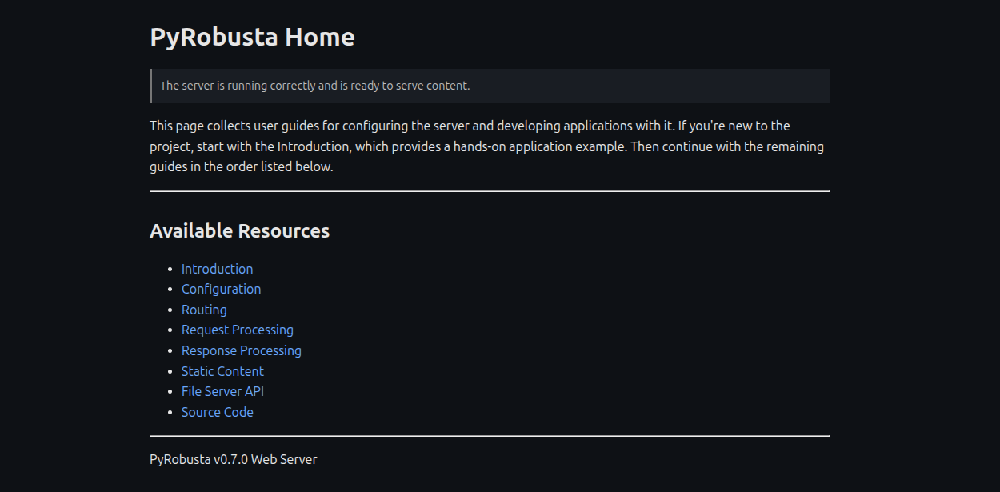

# PyRobusta

PyRobusta is a memory-conscious HTTP/1.1 server library built for embedded devices where heap usage, connection reliability, and stream processing efficiency matter. PyRobusta offers robust keep-alive connection management and efficient byte-stream processing while maintaining a predictable memory footprint.

## HTTP Features
- Routing decorators and wildcard-based URL matching
- Multipart request and response handling
- Support for chunked encoding and streaming payloads
- Query parameter parsing with percent encoding support
- Built-in API for uploading, downloading, and deleting files stored on the server
- Persistent connection handling via the `Connection: keep-alive` header
- HTTP/1.0 and HTTP/1.1 support
- TLS support

## Design Principles

- Predictable memory usage through fixed-size stream buffers
- Incremental byte-stream processing with bounded memory overhead
- State-machine-driven request parsing for extensibility and protocol correctness
- Reliable connection handling with keep-alive, timeouts, and transport error recovery
- Designed specifically for MicroPython and memory-constrained embedded environments

## Project Status

PyRobusta is under active development. The public API is not yet considered
stable and may change between releases.

Starting with v1.0.0, backwards compatibility will be maintained within each major version. Any backwards-incompatible changes introduced before then are clearly documented in the release notes.

# Installation

Install PyRobusta on your MicroPython-enabled device using the mip package manager.

A minimum of 40 KB free heap is required. However, for better usability and stability,
devices with more SRAM are strongly recommended. The ESP32-C3 SuperMini is a good
entry-level option, providing a comfortable amount of free memory after installation.

If you haven’t already set up your environment, follow the [setup guide](./docs/setup.md) to install
mpremote and connect your device to Wi-Fi.


```python
# Install the latest version of PyRobusta
import mip
mip.install("github:szeka9/PyRobusta")

# Install required assets
from pyrobusta.utils.assets import install_www
install_www()

# Start the HTTP server
import asyncio
from pyrobusta.server.http_server import HttpServer

async def main():
    server = HttpServer()
    server.start_socket_server()
    while True:
        await asyncio.sleep(1)

asyncio.run(main())
```

# Verify the Installation

Open a web browser and enter your device’s IP address in the address bar.

If the server is running correctly, the default homepage will be displayed.
Refer to the documentation for configuration options, routing, streaming
payloads, and advanced HTTP features.



## Sample Application

```python
import asyncio
from gc import mem_free, mem_alloc, collect

import pyrobusta.server.http_server as http_server
from pyrobusta.protocol.http import HttpEngine

@HttpEngine.route("/mem-usage", "GET")
def mem_usage(http_ctx, _):
    collect()
    free = mem_free()
    used = mem_alloc()
    usage_percentage = 100 * used / (free + used)
    return "text/plain", (
        f"Currently used: {usage_percentage:.2f}%\n"
        f"Free   [bytes]: {free}\n"
        f"Used   [bytes]: {used}\n"
        f"Total  [bytes]: {used + free}\n"
    )

async def main():
    server = http_server.HttpServer()
    server.start_socket_server()
    while True:
        await asyncio.sleep(1)

asyncio.run(main())
```

Check the [Application Development](./docs/application_development/index.md) guide for
more details on supported features and practical examples.


# Configuration and Optimization

To fine-tune heap usage and optimize performance, see:
- [Dimensioning](./docs/dimensioning/http_dimensioning.md)
- [Configuration Settings](./docs/application_development/configuration.md)

# Development

Check the provided [Development](./docs/development.md) guide to create and deploy custom builds
to your device, as well as running tests and static code checkers.
