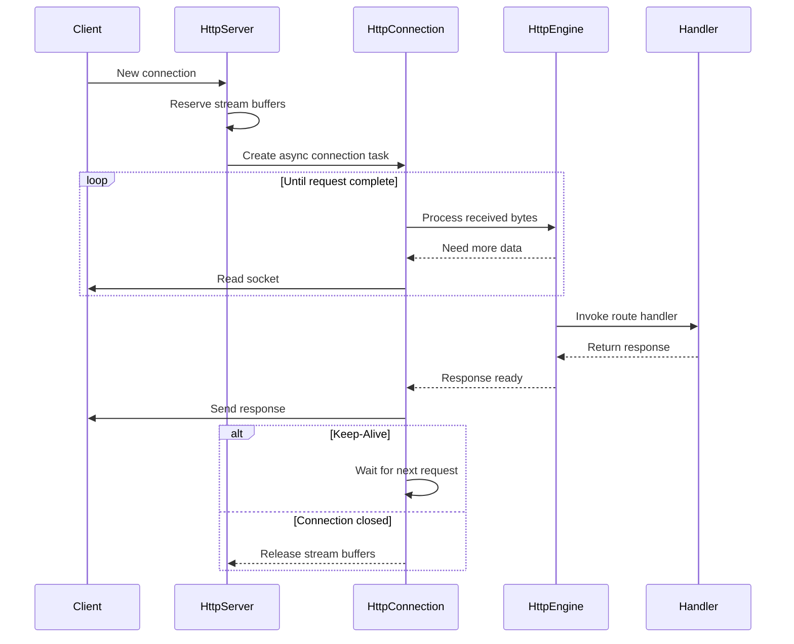

# Concepts

[← Back](index.md)

This chapter introduces the architectural concepts and design principles that underpin PyRobusta.
Detailed information about configuration, routing, and request handling is covered in the correspondingchapters.

---

## Table of Contents

* [Concepts](#concepts)
  + [Purpose](#purpose)
  + [System Overview](#system-overview)
  + [Execution Model](#execution-model)
  + [Memory Model](#memory-model)
  + [Architectural Guarantees](#architectural-guarantees)

---

## Purpose

PyRobusta is a lightweight embedded HTTP web server designed for predictable resource usage on constrained systems.
It provides a concise API for building web applications while emphasizing deterministic memory usage, incremental
byte-stream processing, and bounded memory allocations. These design choices reduce memory pressure and improve
long-term reliability on devices with limited RAM.

## System Overview

PyRobusta is organized into a small number of runtime components, each with well-defined responsibilities.
`HttpServer` admits new connections and provisions stream buffers from a shared resource pool.
`HttpConnection` manages the lifetime of a client connection, including request and response streams and socket I/O.
`HttpEngine` dispatches requests and ensures protocol correctness with incremental request
parsing.
Together, these components isolate networking, protocol processing, and application logic into distinct layers.

### Components
| Component | Responsibility |
| -- | --- |
| HttpServer | Connection management, stream buffer provisioning |
| HttpConnection | Socket I/O, connection lifecycle (keep-alive, timeout) |
| HttpEngine | Incremental stream parsing, HTTP protocol validation, request routing |
| Application Handler | Application-specific processing, response generation |

## Execution Model

PyRobusta is based on the uasyncio I/O scheduler implemented in MicroPython.
`HttpServer` internally creates an asynchronous socket server that accepts client connections
and associates each connection with a `StreamReader` and `StreamWriter` pair for network I/O.

Each client connection executes as an independent asynchronous task, allowing multiple connections
to make progress concurrently. `HttpServer` maintains the set of active connections and admits
new connections until the configured maximum number of concurrent connections is reached. `HttpServer`
closes idle connections after the configured timeout to reclaim resources. Because each connection is
processed independently, slow clients do not block unrelated connections. However, requests within
the same connection are always processed sequentially.

## Memory Model

PyRobusta ensures bounded memory usage by allocating a fixed number of per-connection stream buffer pairs from
a shared buffer pool. The maximum number of concurrent connections determines the size of this pool.
**Because stream buffers have a fixed size, memory usage per connection is bounded. Memory required
for normal request processing is reserved when a connection is admitted, rather than during request handling.**

For each new connection, the server reserves a request and response stream buffer from the shared buffer pool.
When all stream buffers are reserved, new connections are blocked until a buffer pair becomes available
(either through connection closure or timeout). `HttpServer` automatically closes connections that remain inactive for too long.

Stream buffers are preallocated during server initialization based on the configured memory limits.
Their size and number remain fixed throughout the lifetime of the server. **Preallocating stream buffers reduces heap
fragmentation, improving memory stability and reducing the risk of runtime allocation failures.**

`HttpEngine` minimizes heap allocations by utilizing memoryviews for passing payload arguments to route handlers.
Memoryviews share the same underlying bytearray with stream buffers used for socket I/O, allowing application code
to access request bodies without copying the underlying data.

Incremental request parsing requires buffers that support incremental consumption of parsed data while new bytes
continue to arrive. PyRobusta therefore uses stream buffers designed for incremental processing rather than
fixed byte buffers without consumption semantics.

Request processing is constrained by the size of the per-connection stream buffer. While request lines and header
sections must fit entirely within the available buffer space, request bodies may be processed incrementally
depending on the transfer encoding. Incremental processing allows request bodies to exceed the buffer size
because they are received as independent processing units. **This model allows arbitrarily large uploads to be
processed without buffering the complete request body in memory.**

* Multipart requests: each part must fit within the stream buffer and is processed independently.
* Chunked requests: each chunk must fit within the stream buffer and is processed independently.
* Regular requests: the entire request body must fit within the stream buffer.

## Architectural Guarantees

### Ownership
* Every request is processed by exactly one `HttpConnection`.
* Every request is dispatched through `HttpEngine`.
* Connections are admitted only when the required stream buffers are available.
* Each active connection owns a dedicated request and response stream buffer.

### Processing
* For streaming request bodies, protocol parsing and application callbacks may be interleaved, allowing data to be processed incrementally.
* Application callbacks are invoked only after the corresponding protocol state has been successfully validated.
* All protocol errors are converted into HTTP error responses.

Together, these architectural decisions enable PyRobusta to handle HTTP requests with predictable resource usage,
incremental request processing, and deterministic behavior suitable for resource-constrained embedded systems.

---

PyRobusta v0.7.0 Web Server
