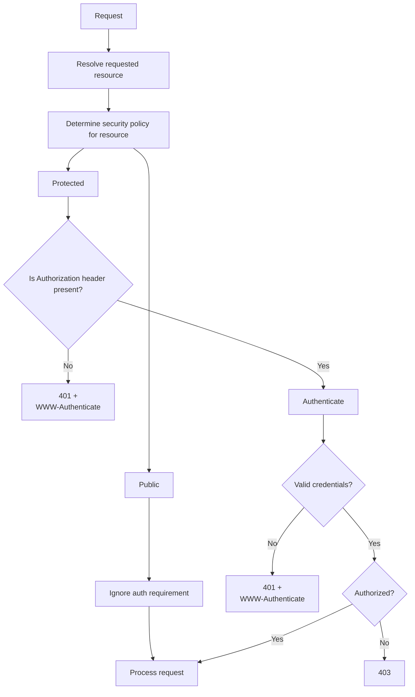

# Authentication & Security

[← Back](index.md)

This page documents the security features provided by PyRobusta,
including HTTP Basic Authentication, role-based authorization, and TLS.

Note: Authentication verifies the client's identity. Authorization determines
whether the authenticated user is permitted to access a resource.

---

## Table of Contents

* [Authentication & Security](#authentication-security)
  + [Basic Authentication](#basic-authentication)
  + [Authorization](#authorization)
  + [HTTPS / TLS](#https-tls)
  + [Certificate Installation](#certificate-installation)

---

## Basic Authentication

PyRobusta supports HTTP Basic Authentication with per-user credentials
stored on the device. Passwords are stored as SHA-256 hashes.
Basic authentication is disabled by default. It can be enabled by setting
`http_auth=basic` in [pyrobusta.env](configuration.md).

During initialization, PyRobusta reads `pyrobusta.passwd`
from the server's working directory. Each entry specifies a username,
a password hash, and one or more role names.

PyRobusta defines a single realm (`realm="Device"`) to authenticate against.
The server response includes the `WWW-Authenticate: Basic realm="Device"` header
when a request does not contain valid credentials.

### pyrobusta.passwd

`pyrobusta.passwd` utilizes a passwd-like format, specifying one user per line,
with each element of the user data separated by `:`. The expected format
of a user entry is `<username>:<SHA256-password-hash>:<comma-separated-role-names>`.

```
# Example
# File: /pyrobusta.passwd
szeka9:9b085649ac73a164314f00ec70010ec37d6c663cf71e9672a0600d6609b3ae12:api_admin
user-1:c0418ce1f43b9013c6871d4ac4941de6cd83a3fac29677785b250b86c88320a0:api_user,app_viewer
[...]
user-n:a8105c3c8b75556a9099b8dcab9cc13362d5a6f9fa5888ce39efc57961deb519:api_user,app_maintainer
```

When adding new users, follow the below steps to calculate the password hash:

```python3
import hashlib

password_raw = "<password-data>"
password_hash = hashlib.sha256(password_raw.encode()).digest().hex()
print(password_hash) # paste the output into pyrobusta.passwd

b9fa35baa8069f3dabe214aed3525da0824efefdbce5ad83dfe4e7f48f8ce15f
```

## Authorization

When HTTP Basic Authentication is enabled, PyRobusta provides role-based access control (RBAC).
Resource permissions are determined by the authenticated user's assigned roles.
Each user can be assigned one or more roles, configured in `pyrobusta.passwd`.

While `pyrobusta.passwd` assigns roles to users, `pyrobusta.roles` maps those roles to
HTTP methods and server resources. Authorization follows a least-privilege model.
Users have no permissions unless explicitly granted by one or more authorization rules.
Each matching rule grants additional permissions. Requests that do not match an authorization
rule receive HTTP 403 Forbidden.

### pyrobusta.roles

`pyrobusta.roles` consists of one or more authorization blocks. Each block defines one or
more path patterns, followed by one or more authorization rules. Every authorization rule
applies to every path pattern declared within the same block.

```
<path-pattern>
<path-pattern>
...
    <HTTP-method>: <role>,<role>,...
    <HTTP-method>: <role>,<role>,...
    ...

<path-pattern>
    ...
```

Authorization rules are selected based on pattern specificity rather than their
order in `pyrobusta.roles`. Path patterns support the following forms, ordered
from least to most specific. Each request is matched against the most specific
pattern, and only the roles associated with the selected pattern are considered
during authorization.

```
/**                        # Match any path
/*                         # Match direct children of /
/app                       # Exact match
/app/**                    # Match any descendant of /app
/app/*                     # Match direct children of /app
/app/*/resources           # Match a single wildcard segment
/app/endpoint/resources    # Exact match
```

**Note**: recursive globs (`**`) are only supported as the final path segment.
Allowing `**` in intermediate segments would introduce ambiguous matches
and is therefore not supported.

```
# File: /pyrobusta.roles

# ---------------------------------------------------------
# Example: public resources (/, /index.html, /styles.css, ...)
/
/*
    GET,HEAD: *

# ---------------------------------------------------------
# Example: apply rule to parent and child resources
/app/resource
/app/resource/*
    GET: resource_viewer
    POST,PUT,DELETE: resource_maintainer

# ---------------------------------------------------------
# Example: apply rule to paths of any length with **
/app/api/**
    GET: api_viewer
    POST,PUT,DELETE: api_maintainer

# ---------------------------------------------------------
# Example: require api_admin access for all HTTP methods
/app/api/management
    *: api_admin

# ---------------------------------------------------------
# Example: restrict all access to a resource
/app/secret
    *:

# ---------------------------------------------------------
# Example: assign multiple roles
/app/logs
    GET: api_admin,api_maintainer
```

**Note**: The special role `*` grants public access regardless of the authenticated user's roles.
Rules that specify `*` do not require authentication.

## Authentication & Authorization Flow



| Condition | Response |
| --- | --- |
| Missing credentials | 401 Unauthorized |
| Invalid credentials | 401 Unauthorized |
| Authenticated but insufficient permissions | 403 Forbidden |

## HTTPS / TLS


## Certificate Installation

---

PyRobusta v0.8.0 Web Server
