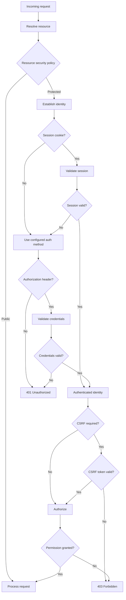

# Authentication & Security

[← Back](index.md)

This page documents the security features provided by PyRobusta,
including HTTP Basic Authentication, role-based authorization, and TLS.

Note: Authentication verifies the client's identity. Authorization determines
whether the authenticated user is permitted to access a resource.

---

## Table of Contents

* [Authentication & Security](#authentication-security)
  + [Basic Authentication](#basic-authentication)
  + [HTTP Sessions](#http-sessions)
  + [Authorization](#authorization)
  + [HTTPS / TLS](#https-tls)
  + [Certificate Installation](#certificate-installation)

---

## Basic Authentication

PyRobusta supports HTTP Basic Authentication with per-user credentials
stored on the device. Passwords are stored as PBKDF2-HMAC-SHA256 hashes
along with randomly generated salt values. Basic authentication is
disabled by default. It can be enabled by setting
`http_auth=basic` in [pyrobusta.env](configuration.md).

During initialization, PyRobusta reads `pyrobusta.passwd` by default
from the server's working directory. Each entry specifies a username,
one or more access role names, password hash and other related metadata.
Set `passwd_file` in the configuration to specify an alternative user
credentials file to load. For more information, see [Server Configuration](./configuration.md).

PyRobusta defines a single realm (`realm="Device"`) to authenticate against.
The server response includes the `WWW-Authenticate: Basic realm="Device"` header
when a request does not contain valid credentials.

### pyrobusta.passwd

`pyrobusta.passwd` utilizes a passwd-like format, specifying one user per line,
with each element of the user data separated by `:`. The expected format
of a user entry is:

```
<username>:<roles>:<password-hash>:<salt>:<iterations>:<algorithm>:<version>
```
- username: name of the user (case insensitive)
- roles: comma-separated role names (case insensitive)
- password-hash: Base64-encoded PBKDF2 output
- salt: Base64-encoded random salt
- iterations: number of PBKDF2 iterations
- algorithm: password hashing algorithm (currently PBKDF2-HMAC-SHA256)
- version: version of PyRobusta when the user was created

```
# Example
# File: /pyrobusta.passwd
szeka9:api_admin:JlSousyaBB87FIIS/xoQIWTCH7+Z/yjQao5NGE7O/ww=:Zz1n+l9UN89hKlpnnvcXAg==:5000:PBKDF2-HMAC-SHA256:v0.8.0
alice:api_user,app_viewer:mKmmf5wBEtlkty7LEcphieciOd3Pl0yY7r3WmDiZnzg=:XTQgg3Has79lDTNYVW+aPw==:5000:PBKDF2-HMAC-SHA256:v0.8.0
bob:api_user,app_maintainer:sOqLqi48jCQUiR+VpcCcfMgKcKCspbE902y0yFe0DV4=:5PzMbQQJtQRP8aZ9C7t8qQ==:5000:PBKDF2-HMAC-SHA256:v0.8.0
[...]
```

New users can be added programmatically through the IAM API:

```python3
from pyrobusta.utils.iam import IAMDatabase
iam_db = IAMDatabase("pyrobusta.passwd", "pyrobusta.roles")
iam_db.load()
iam_db.create_user("johno", "john's-secret-password", ["role-1", "role-2"])
```

Password verification uses PBKDF2-HMAC-SHA256 with a default iteration count of 5000.
The iteration count is intentionally chosen as a compromise between resistance against
offline attacks and the computational limitations of microcontroller-class hardware.
Because lower iteration counts reduce the computational cost of each password guess,
PyRobusta enforces strong password requirements to increase the password search
space and improve resistance against brute-force attacks.

```python3
iam_db.create_user("john", "secret", ["role-1", "role-2"])
Traceback (most recent call last):
  File "<stdin>", line 1, in <module>
  File "src/pyrobusta/utils/iam.py", line 198, in create_user
  File "src/pyrobusta/utils/crypto.py", line 125, in validate_password
ValueError: Password must be at least 16 characters
```

## HTTP Sessions

Without session authentication, each HTTP request authenticated with Basic Auth requires a
new password verification operation. Since PBKDF2 is intentionally computationally expensive,
this can introduce noticeable latency on microcontroller-class hardware.

To avoid repeated password verification, PyRobusta can issue stateless session cookies
after a successful authentication. Subsequent requests are authenticated using the session
cookie instead of recomputing the PBKDF2 password hash.

Session cookies are cryptographically signed and validated by the server without maintaining
per-session state. Session signing keys are derived from per-user secrets that are randomly
generated during server startup and stored only in memory. Consequently, all existing
sessions are invalidated automatically when the server restarts.

Stateless sessions are enabled by setting `http_sessions=true` in pyrobusta.env.
Sessions expire after 15 minutes by default. The session lifetime can be configured with
`http_session_ttl_sec`.


## Authorization

When HTTP Basic Authentication is enabled, PyRobusta provides role-based access control (RBAC).
Resource permissions are determined by the authenticated user's assigned roles.
Each user can be assigned one or more roles, configured in `pyrobusta.passwd`.

While `pyrobusta.passwd` assigns roles to users, `pyrobusta.roles` maps those roles to
HTTP methods and server resources. Authorization follows a least-privilege model.
Users have no permissions unless explicitly granted by one or more authorization rules.
Each matching rule grants additional permissions. Requests that do not match an authorization
rule receive HTTP 403 Forbidden.

Set `roles_file` in the configuration to specify an alternative role configuration file to load.
For more information, see [Server Configuration](./configuration.md).

### pyrobusta.roles

`pyrobusta.roles` consists of one or more authorization blocks. Each block defines one or
more path patterns, followed by one or more authorization rules. Every authorization rule
applies to every path pattern declared within the same block.

```
<path-pattern>
<path-pattern>
...
    <HTTP-method>: <role>,<role>,...
    <HTTP-method>: <role>,<role>,...
    ...

<path-pattern>
    ...
```

Authorization rules are selected based on pattern specificity rather than their
order in `pyrobusta.roles`. Path patterns support the following forms, ordered
from least to most specific. Each request is matched against the most specific
pattern, and only the roles associated with the selected pattern are considered
during authorization.

```
/**                        # Match any path
/*                         # Match direct children of /
/app                       # Exact match
/app/**                    # Match any descendant of /app
/app/*                     # Match direct children of /app
/app/*/resources           # Match a single wildcard segment
/app/endpoint/resources    # Exact match
```

**Note**: recursive globs (`**`) are only supported as the final path segment.
Allowing `**` in intermediate segments would introduce ambiguous matches
and is therefore not supported.

```
# File: /pyrobusta.roles

# ---------------------------------------------------------
# Example: public resources (/, /index.html, /styles.css, ...)
/
/*
    GET,HEAD: *

# ---------------------------------------------------------
# Example: apply rule to parent and child resources
/app/resource
/app/resource/*
    GET: resource_viewer
    POST,PUT,DELETE: resource_maintainer

# ---------------------------------------------------------
# Example: apply rule to paths of any length with **
/app/api/**
    GET: api_viewer
    POST,PUT,DELETE: api_maintainer

# ---------------------------------------------------------
# Example: require api_admin access for all HTTP methods
/app/api/management
    *: api_admin

# ---------------------------------------------------------
# Example: restrict all access to a resource
/app/secret
    *:

# ---------------------------------------------------------
# Example: assign multiple roles
/app/logs
    GET: api_admin,api_maintainer
```

**Note**: The special role `*` grants public access regardless of the authenticated user's roles.
Rules that specify `*` do not require authentication.

## CSRF Protection

Credentials used with HTTP Basic Authentication may be automatically attached to requests by a browser.
This makes HTTP Basic Authentication vulnerable to CSRF (Cross-Site Request Forgery) attacks,
allowing an attacker-controlled website to cause the browser to issue requests to the server on
behalf of an authenticated user.

To prevent CSRF attacks, **PyRobusta applies the Signed Double-Submit Cookie pattern**. For unsafe HTTP methods
(POST, PUT, PATCH, and DELETE), the client must return the CSRF token received from the server as
a cookie. The client must send the same token in the `X-CSRF-Token` request header. The server
rejects requests where the cookie value and header value do not match.

A malicious website cannot read the CSRF cookie from another origin because of the browser's
same-origin policy. Therefore, a malicious website cannot provide a valid CSRF token in the request header.
Cryptographic signing prevents attackers from forging valid CSRF tokens without knowledge of the server-side secret.

PyRobusta generates CSRF tokens using HMAC-SHA256 with per-user secrets generated during server
initialization. User secrets exist only in memory, so restarting the server invalidates all
previous CSRF tokens. The server issues a CSRF cookie after successful authentication. Clients
must include the same token in the `X-CSRF-Token` header for subsequent unsafe requests.

Tokens generated by PyRobusta have the following format:

```
<hex-encoded-random-nonce>.<hex-encoded-HMAC-SHA256-signature>
```

During verification, PyRobusta recalculates the HMAC-SHA256 signature over the nonce using the
user secret and compares it with the signature provided in the token. Requests are rejected with HTTP
`403 Forbidden` if the token signature is invalid or if the cookie and `X-CSRF-Token` header values do not match.

## Authentication & Authorization Flow


```mermaid
flowchart TD
    A[Incoming request]

    A --> B[Resolve resource]
    B --> C{Resource security policy}

    C -->|Public| Z[Process request]

    C -->|Protected| D[Establish identity]

    D --> E{Session cookie?}

    E -->|Yes| F[Validate session]
    E -->|No| G[Use configured auth method]

    F --> H{Session valid?}
    H -->|Yes| I[Authenticated identity]
    H -->|No| G

    G --> J{Authorization header?}
    J -->|No| K[401 Unauthorized]
    J -->|Yes| L[Validate credentials]

    L --> M{Credentials valid?}
    M -->|No| K
    M -->|Yes| I

    I --> N{CSRF required?}
    N -->|No| O[Authorize]
    N -->|Yes| P{CSRF token valid?}

    P -->|No| Q[403 Forbidden]
    P -->|Yes| O

    O --> R{Permission granted?}
    R -->|Yes| Z
    R -->|No| Q
```

PyRobusta returns the following HTTP status codes for authentication and authorization failures:

| Condition | Response |
| --- | --- |
| Missing authentication credentials | 401 Unauthorized |
| Invalid authentication credentials | 401 Unauthorized |
| Authenticated, but CSRF validation failed | 403 Forbidden |
| Authenticated, but authorization failed | 403 Forbidden |

## HTTPS / TLS


## Certificate Installation

---

PyRobusta v0.8.0 Web Server
