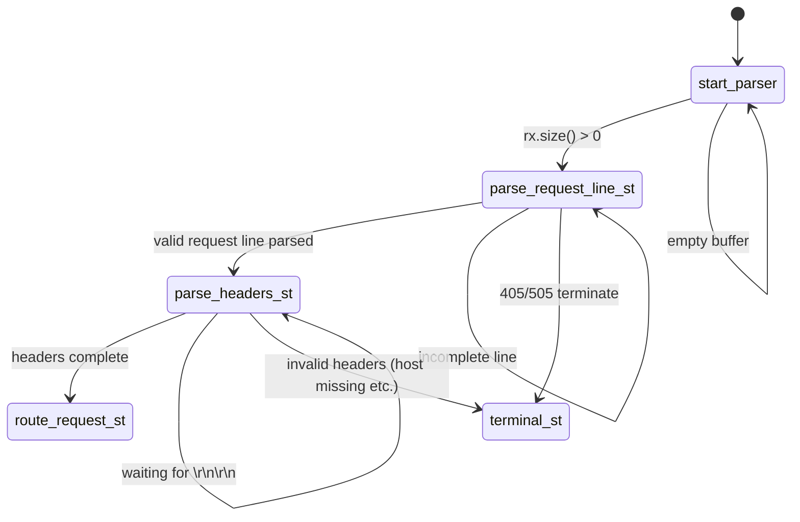
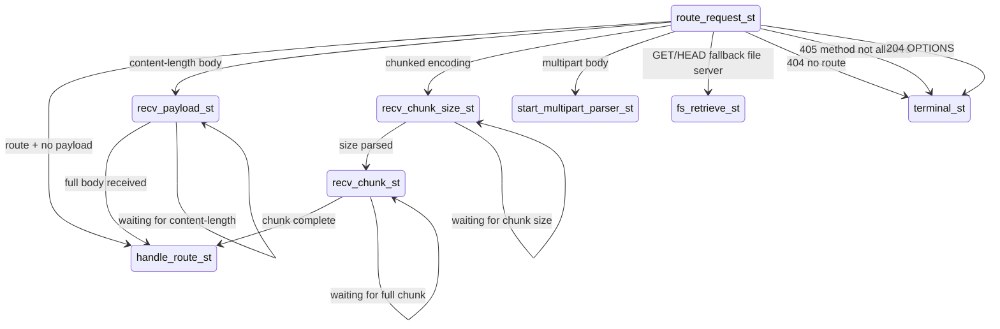
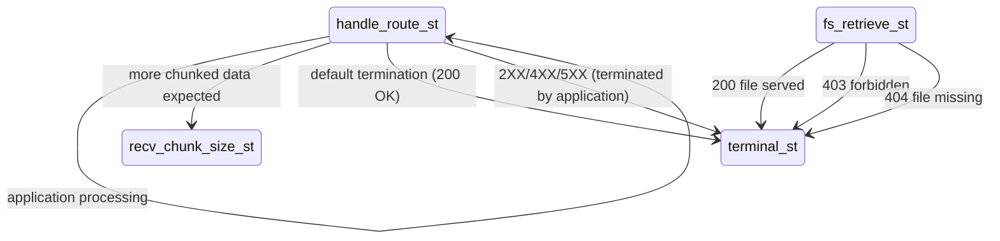
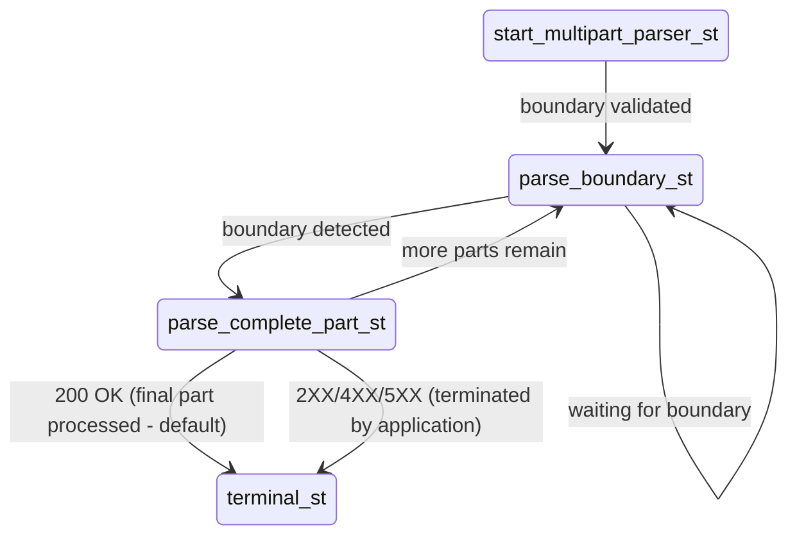
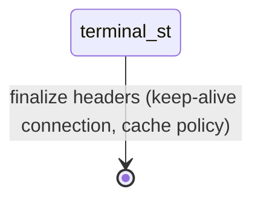
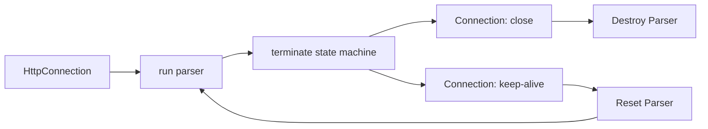

# HTTP state machine parser

[http.py](../../src/pyrobusta/protocol/http.py) implements a finite state machine (FSM) whose states
are represented by handler functions. Each state consumes as much available data as necessary
to make progress, or returns control to the event loop until additional input becomes available.

In general, states are not required to transition to a terminal state if a request is incomplete.
Instead, states return control to the asyncio event loop, which drives subsequent invocations of the
state machine based on socket readiness. The state machine may be terminated by the surrounding coroutine in
the case of a connection timeout or transport error, separating HTTP protocol semantics from transport-level
I/O scheduling concerns.

The state machine can be decomposed into four sub-FSMs with a common terminal state. Each sub-FSM eventually
transitions to `terminal_st`, which serves as a finalization state responsible for emitting HTTP headers required
for interoperability, such as connection persistence and cache-control directives. The terminal state can only be reached
by calling `HttpEngine.terminate()`, which requires a valid HTTP status code. The method may be invoked by the user application, the coroutine responsible for socket handling, or the state machine itself.

The state machine is associated with a single HTTP connection and maintains dedicated request and response stream buffers.
For persistent connections, the state machine instance is reset and reused for each request received on the connection.
The `HttpConnection` class is responsible for advancing the state machine, scheduling socket I/O through asyncio's `StreamReader` and `StreamWriter` interfaces, and reusing the state machine across persistent connections.

## HTTP Request Line and Header Parsing

## Routing and Body Strategy Selection

## Application Execution and Response Generation

## Multipart Request Processing

## State Machine Termination

## Connection Lifecycle
