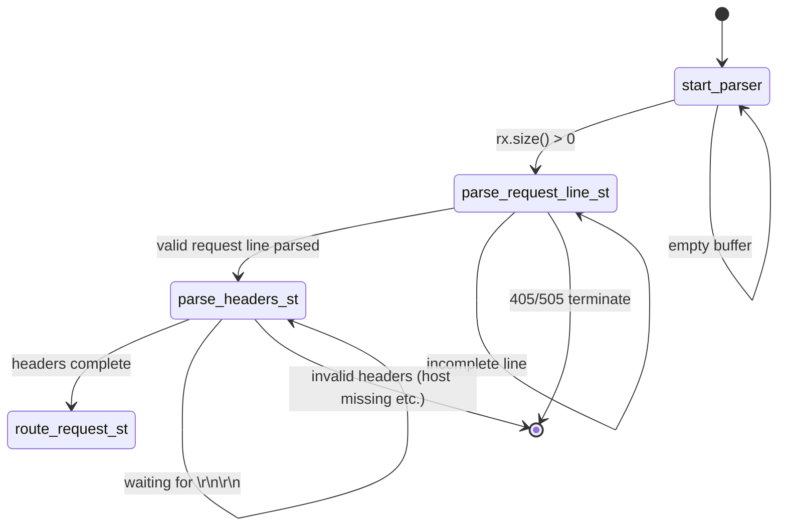
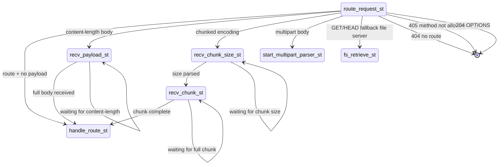
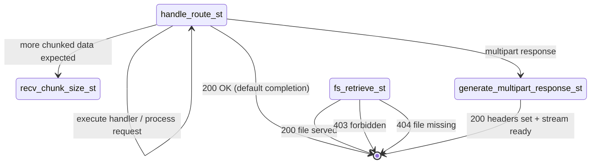
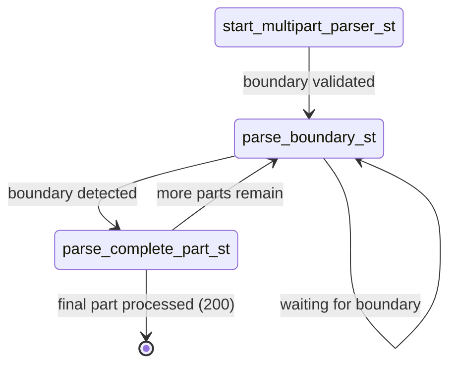

# HTTP state machine parser

[http.py](../../src/pyrobusta/protocol/http.py) implements a continuation passing parser using a
finite state machine (FSM). Each state consumes available sufficient data to make progress or explicitly
suspend until more data arrives.

In general, states are not required to transition to a terminal state if a request is incomplete.
Instead, states return control to the asyncio event loop, which drives subsequent invocations of the
state machine based on socket readiness. The state machine may be terminated by the surrounding coroutine in
the case of a session timeout or transport error. This is a deliberate architectural decision to separate HTTP
protocol semantics from transport-level I/O scheduling concerns.

The state machine can be decomposed to four sub-FSMs, depicted by the below diagrams. The state machine applies
to a single HTTP session with a dedicated request and response stream buffer.

## HTTP Request Line and Header Parsing

## Routing and Body Strategy Selection

## Application Execution and Response Generation

## Multipart Request Processing
