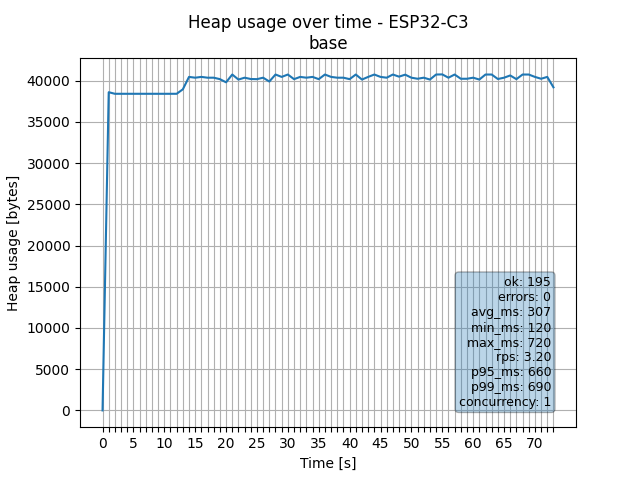
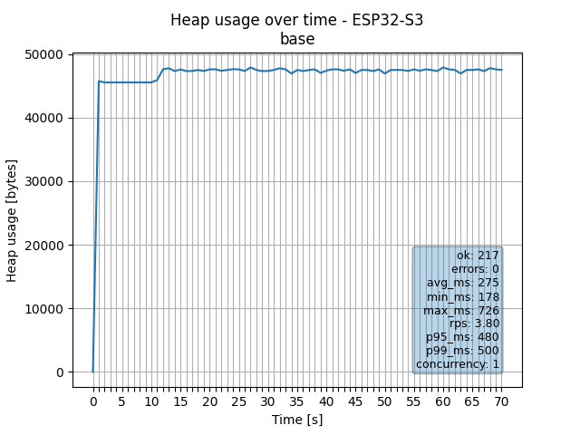

Use the following measurement data to guide configuration choices when dimensioning the\
HTTP server for specific constraints such as memory footprint, request throughput, and\
feature enablement (e.g., TLS, multipart handling, file serving).

The tables below are derived from controlled benchmarks. Each measurement varies a subset\
of parameters relative to a defined baseline configuration.

```.env
# Base configuration
socket_max_con=1
http_mem_cap=0.05
http_multipart=False
http_files_api=False
tls=False
http_port=8080
https_port=4443
log_level=info
http_served_paths=/lib/pyrobusta /www
```

# ESP32-C3 "SuperMini" (ESP32-C3FH4)
The ESP32-C3 provides approximately 162KB of usable heap. It is recommended to limit the maximum\
number of socket connections to 2 (socket_max_con).

## Idle heap usage
The table below reports heap consumption after module imports, measured under idle conditions\
with no active network traffic.

| id | http_mem_cap | http_multipart | socket_max_con | tls | footprint_bytes |
| --- | --- | --- | --- | --- | --- |
| base | 0.05 | False | 1 | False | 40320 |
| low_mem_cap_001 | 0.0127 | False | 1 | False | 40320 |
| low_mem_cap_002 | 0.0253 | False | 2 | False | 41536 |
| low_mem_cap_003 | 0.0505 | False | 4 | False | 43968 |
| high_mem_cap_001 | 0.0568 | False | 1 | False | 47488 |
| high_mem_cap_002 | 0.114 | False | 2 | False | 55872 |
| high_mem_cap_003 | 0.228 | False | 4 | False | 72640 |
| multipart_001 | 0.0127 | True | 1 | False | 45040 |
| multipart_002 | 0.0253 | True | 2 | False | 46256 |
| multipart_003 | 0.0505 | True | 4 | False | 48688 |
| files_api_001 | 0.0127 | False | 1 | False | 47872 |
| files_api_002 | 0.0253 | False | 2 | False | 49088 |
| files_api_003 | 0.0505 | False | 4 | False | 51520 |
| tls_001 | 0.0127 | False | 1 | True | 43040 |
| tls_002 | 0.0253 | False | 2 | True | 44256 |

## Heap usage under network traffic



# ESP32-S3 (8MB PSRAM)
The table below reports heap consumption after module imports, measured under idle conditions\
with no active network traffic.

## Idle heap usage
| id | http_mem_cap | http_multipart | socket_max_con | tls | footprint_bytes |
| --- | --- | --- | --- | --- | --- |
| base | 0.05 | False | 1 | False | 47456 |
| low_mem_cap_001 | 0.000247 | False | 1 | False | 40288 |
| low_mem_cap_002 | 0.000493 | False | 2 | False | 41504 |
| low_mem_cap_003 | 0.000985 | False | 4 | False | 43936 |
| high_mem_cap_001 | 0.00111 | False | 1 | False | 47456 |
| high_mem_cap_002 | 0.00222 | False | 2 | False | 55840 |
| high_mem_cap_003 | 0.00443 | False | 4 | False | 72608 |
| multipart_001 | 0.000247 | True | 1 | False | 44848 |
| multipart_002 | 0.000493 | True | 2 | False | 46064 |
| multipart_003 | 0.000985 | True | 4 | False | 48496 |
| files_api_001 | 0.000247 | False | 1 | False | 47840 |
| files_api_002 | 0.000493 | False | 2 | False | 49056 |
| files_api_003 | 0.000985 | False | 4 | False | 51488 |
| tls_001 | 0.000247 | False | 1 | True | 42624 |
| tls_002 | 0.000493 | False | 2 | True | 43840 |
| tls_003 | 0.000985 | False | 4 | True | 46272 |

## Heap usage under network traffic
