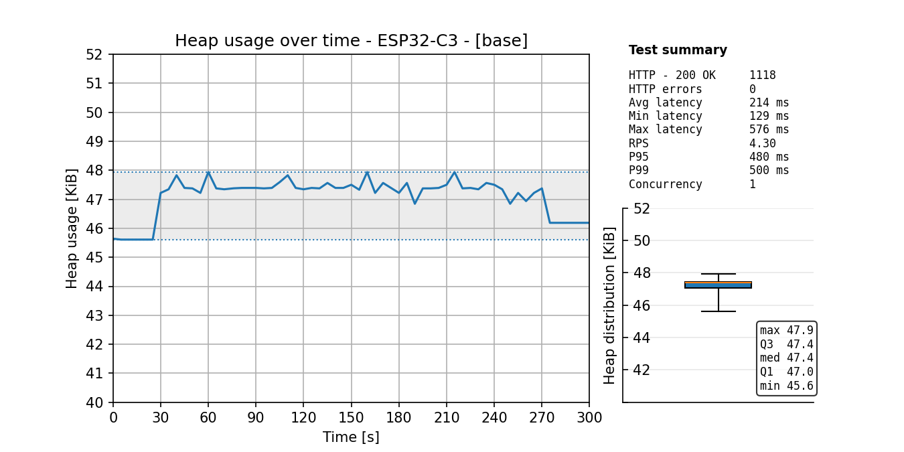
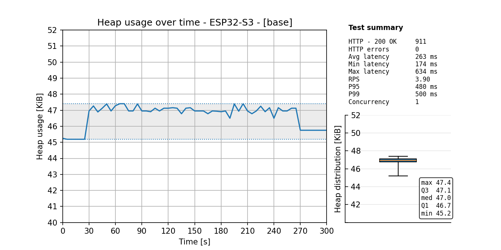

# Server Dimensioning

Use the following measurement data to guide configuration choices when dimensioning the
HTTP server for specific constraints such as memory footprint, request throughput, and
feature enablement (e.g., TLS, multipart handling, file serving).

The tables below are derived from controlled benchmarks. Each measurement varies a subset
of parameters relative to a defined baseline configuration.

```.env
# Base configuration
tls=False
socket_max_con=1
http_mem_cap=0.1
http_port=8080
https_port=4443
http_multipart=False
http_files_api=False
http_browser_security=False
http_auth=""
http_sessions=False
```

## ESP32-C3 "SuperMini" (ESP32-C3FH4)
The ESP32-C3 provides approximately 130KB of usable heap. It is recommended to limit the maximum
number of socket connections to 2 (socket_max_con).

### Idle heap usage
The table below reports heap consumption after module imports, measured under idle conditions
with no active network traffic.

| id | http_auth | http_browser_security | http_files_api | http_mem_cap | http_multipart | http_sessions | socket_max_con | tls | footprint_bytes |
| --- | --- | --- | --- | --- | --- | --- | --- | --- | --- |
| [base](./esp32_c3/base.png) | N/A | False | False | 0.1 | False | False | 1 | False | 48244 |
| [low_mem_cap_001](./esp32_c3/low_mem_cap_001.png) | N/A | False | False | 0.0127 | False | False | 1 | False | 39524 |
| [low_mem_cap_002](./esp32_c3/low_mem_cap_002.png) | N/A | False | False | 0.0253 | False | False | 2 | False | 40692 |
| [low_mem_cap_003](./esp32_c3/low_mem_cap_003.png) | N/A | False | False | 0.0505 | False | False | 4 | False | 42964 |
| [high_mem_cap_001](./esp32_c3/high_mem_cap_001.png) | N/A | False | False | 0.0568 | False | False | 1 | False | 48232 |
| [high_mem_cap_002](./esp32_c3/high_mem_cap_002.png) | N/A | False | False | 0.114 | False | False | 2 | False | 55028 |
| [high_mem_cap_003](./esp32_c3/high_mem_cap_003.png) | N/A | False | False | 0.228 | False | False | 4 | False | 42996 |
| [multipart_001](./esp32_c3/multipart_001.png) | N/A | False | False | 0.0127 | True | False | 1 | False | 48949 |
| [multipart_002](./esp32_c3/multipart_002.png) | N/A | False | False | 0.0253 | True | False | 2 | False | 47972 |
| [multipart_003](./esp32_c3/multipart_003.png) | N/A | False | False | 0.0505 | True | False | 4 | False | 50276 |
| [files_api_001](./esp32_c3/files_api_001.png) | N/A | False | True | 0.0127 | False | False | 1 | False | 46836 |
| [files_api_002](./esp32_c3/files_api_002.png) | N/A | False | True | 0.0253 | False | False | 2 | False | 47988 |
| [files_api_003](./esp32_c3/files_api_003.png) | N/A | False | True | 0.0505 | False | False | 4 | False | 50260 |
| [tls_001](./esp32_c3/tls_001.png) | N/A | False | False | 0.0127 | False | False | 1 | True | 43758 |
| [tls_002](./esp32_c3/tls_002.png) | N/A | False | False | 0.0253 | False | False | 2 | True | 42772 |
| [tls_003](./esp32_c3/tls_003.png) | N/A | False | False | 0.0505 | False | False | 4 | True | 45060 |
| [browser_security_001](./esp32_c3/browser_security_001.png) | N/A | True | False | 0.0127 | False | False | 1 | False | 44185 |
| [browser_security_002](./esp32_c3/browser_security_002.png) | N/A | True | False | 0.0253 | False | False | 2 | False | 43780 |
| [browser_security_003](./esp32_c3/browser_security_003.png) | N/A | True | False | 0.0505 | False | False | 4 | False | 46084 |
| [auth_001](./esp32_c3/auth_001.png) | basic | False | False | 0.0127 | False | True | 1 | True | 55172 |
| [auth_002](./esp32_c3/auth_002.png) | basic | False | False | 0.0253 | False | True | 2 | True | 56292 |
| [auth_003](./esp32_c3/auth_003.png) | basic | False | False | 0.0505 | False | True | 4 | True | 58596 |

### Heap usage under network traffic



## ESP32-S3 (8MB PSRAM)

### Idle heap usage
The table below reports heap consumption after module imports, measured under idle conditions
with no active network traffic.

| id | http_auth | http_browser_security | http_files_api | http_mem_cap | http_multipart | http_sessions | socket_max_con | tls | footprint_bytes |
| --- | --- | --- | --- | --- | --- | --- | --- | --- | --- |
| [base](./esp32_s3/base.png) | N/A | False | False | 0.1 | False | False | 1 | False | 47835 |
| [low_mem_cap_001](./esp32_s3/low_mem_cap_001.png) | N/A | False | False | 0.000247 | False | False | 1 | False | 40633 |
| [low_mem_cap_002](./esp32_s3/low_mem_cap_002.png) | N/A | False | False | 0.000493 | False | False | 2 | False | 40263 |
| [low_mem_cap_003](./esp32_s3/low_mem_cap_003.png) | N/A | False | False | 0.000985 | False | False | 4 | False | 42567 |
| [high_mem_cap_001](./esp32_s3/high_mem_cap_001.png) | N/A | False | False | 0.00111 | False | False | 1 | False | 47793 |
| [high_mem_cap_002](./esp32_s3/high_mem_cap_002.png) | N/A | False | False | 0.00222 | False | False | 2 | False | 54599 |
| [high_mem_cap_003](./esp32_s3/high_mem_cap_003.png) | N/A | False | False | 0.00443 | False | False | 4 | False | 71239 |
| [multipart_001](./esp32_s3/multipart_001.png) | N/A | False | False | 0.000247 | True | False | 1 | False | 46327 |
| [multipart_002](./esp32_s3/multipart_002.png) | N/A | False | False | 0.000493 | True | False | 2 | False | 47479 |
| [multipart_003](./esp32_s3/multipart_003.png) | N/A | False | False | 0.000985 | True | False | 4 | False | 49783 |
| [files_api_001](./esp32_s3/files_api_001.png) | N/A | False | True | 0.000247 | False | False | 1 | False | 46361 |
| [files_api_002](./esp32_s3/files_api_002.png) | N/A | False | True | 0.000493 | False | False | 2 | False | 47513 |
| [files_api_003](./esp32_s3/files_api_003.png) | N/A | False | True | 0.000985 | False | False | 4 | False | 49815 |
| [tls_001](./esp32_s3/tls_001.png) | N/A | False | False | 0.000247 | False | False | 1 | True | 42950 |
| [tls_002](./esp32_s3/tls_002.png) | N/A | False | False | 0.000493 | False | False | 2 | True | 42327 |
| [tls_003](./esp32_s3/tls_003.png) | N/A | False | False | 0.000985 | False | False | 4 | True | 44631 |
| [browser_security_001](./esp32_s3/browser_security_001.png) | N/A | True | False | 0.000247 | False | False | 1 | False | 39863 |
| [browser_security_002](./esp32_s3/browser_security_002.png) | N/A | True | False | 0.000493 | False | False | 2 | False | 41015 |
| [browser_security_003](./esp32_s3/browser_security_003.png) | N/A | True | False | 0.000985 | False | False | 4 | False | 43319 |
| [auth_001](./esp32_s3/auth_001.png) | basic | False | False | 0.000247 | False | True | 1 | True | 57307 |
| [auth_002](./esp32_s3/auth_002.png) | basic | False | False | 0.000493 | False | True | 2 | True | 56425 |
| [auth_003](./esp32_s3/auth_003.png) | basic | False | False | 0.000985 | False | True | 4 | True | 58793 |

### Heap usage under network traffic
