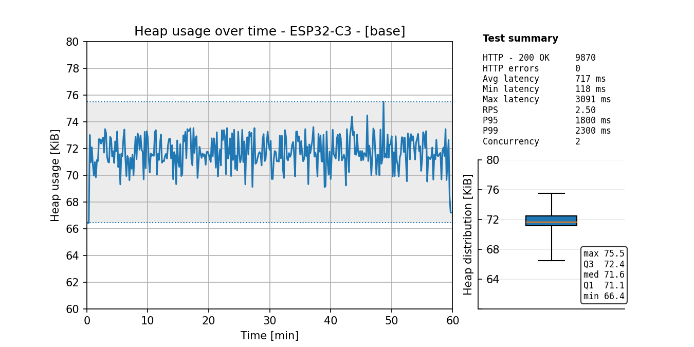
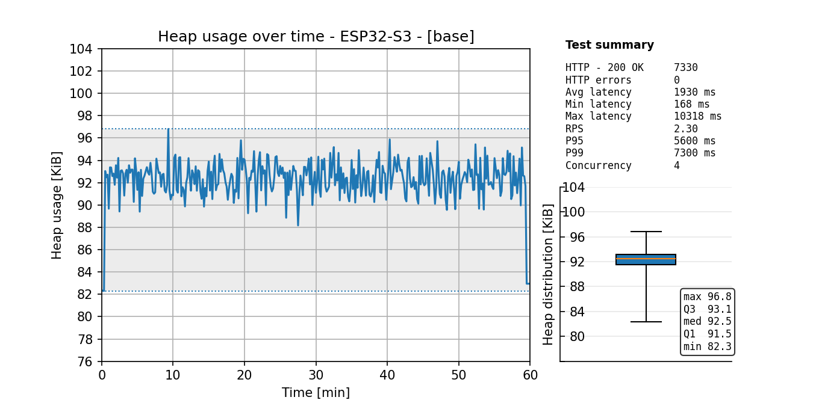

# Soak Testing Measurements

The following measurement data captures the performance characteristics of the server
under sustained load over a one-hour test period. Each test case subjects the target device
to a high load by enabling all HTTP features and generating the corresponding traffic types.

Each target device is tested both with and without TLS enabled. In the TLS-enabled configuration,
HTTP authentication and session management are also enabled.

```.env
# Base configuration
tls=False
http_mem_cap=1.0
http_port=8080
https_port=4443
http_multipart=True
http_files_api=True
http_browser_security=True
http_auth=""
http_sessions=False
```

## ESP32-C3 "SuperMini" (ESP32-C3FH4)

The ESP32-C3 provides approximately 130KB of usable heap. With all HTTP features enabled, it is recommended
to limit the maximum number of socket connections to 2 (socket_max_con) when TLS is disabled. With TLS enabled,
socket connections should be limited to 1.

### Idle heap usage
The table below reports heap consumption after module imports, measured under idle conditions
with no active network traffic.

| id | http_auth | http_browser_security | http_files_api | http_mem_cap | http_multipart | http_sessions | socket_max_con | tls | footprint_bytes |
| --- | --- | --- | --- | --- | --- | --- | --- | --- | --- |
| [base](./esp32_c3/base.png) | N/A | True | True | 1.0 | True | False | 2 | False | 73398 |
| [tls_001](./esp32_c3/tls_001.png) | basic | True | True | 1.0 | True | True | 1 | True | 76057 |

### Heap usage under network traffic


## ESP32-S3 (8MB PSRAM)

### Idle heap usage
The table below reports heap consumption after module imports, measured under idle conditions
with no active network traffic.

| id | http_auth | http_browser_security | http_files_api | http_mem_cap | http_multipart | http_sessions | socket_max_con | tls | footprint_bytes |
| --- | --- | --- | --- | --- | --- | --- | --- | --- | --- |
| [base](./esp32_s3/base.png) | N/A | True | True | 1.0 | True | False | 4 | False | 84305 |
| [tls_001](./esp32_s3/tls_001.png) | basic | True | True | 1.0 | True | True | 4 | True | 97425 |

### Heap usage under network traffic
